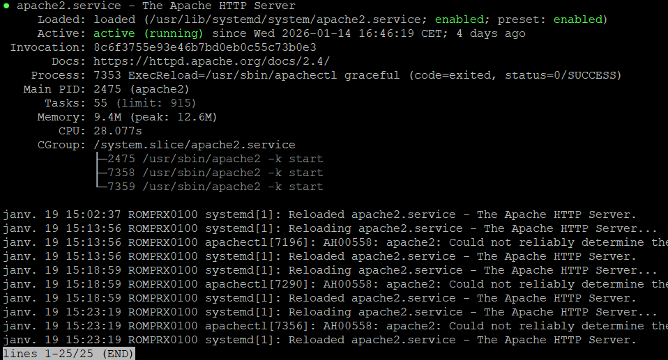
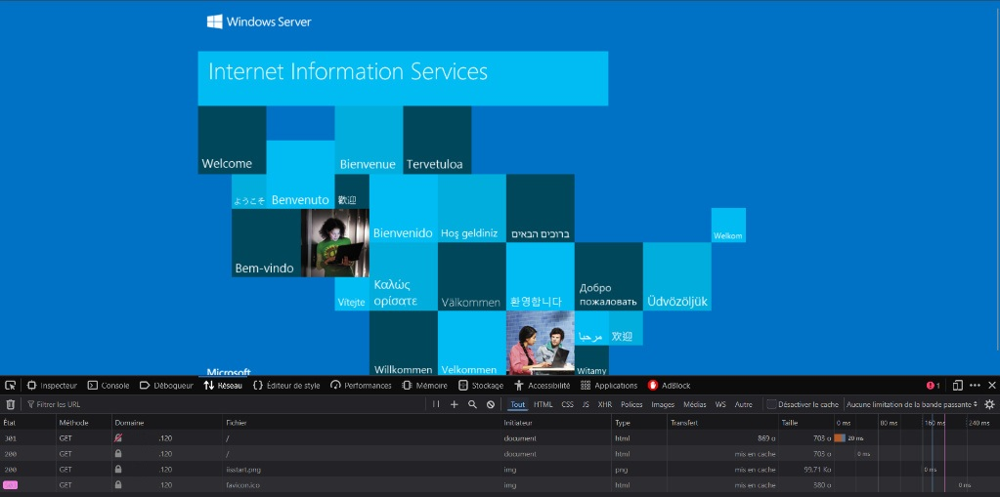
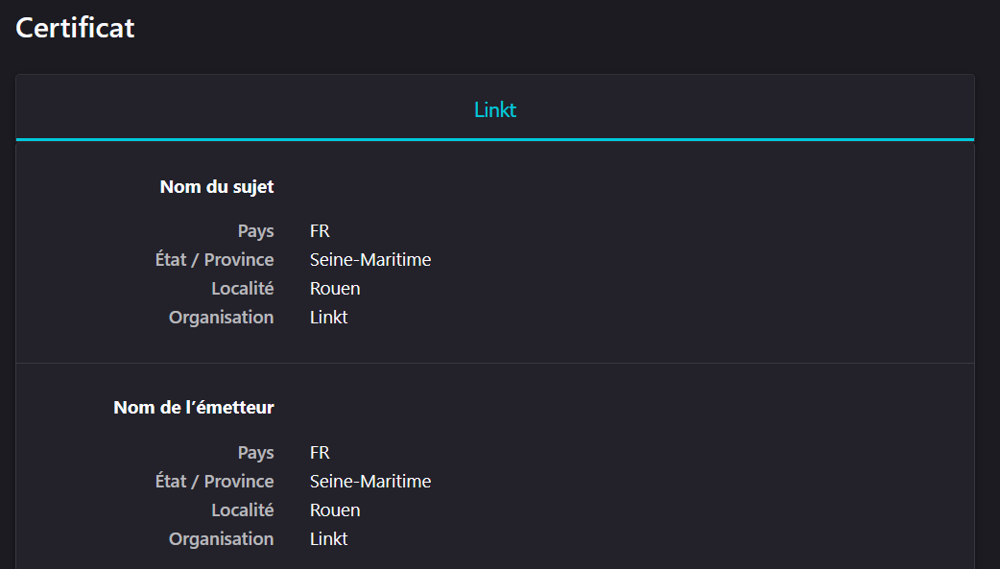
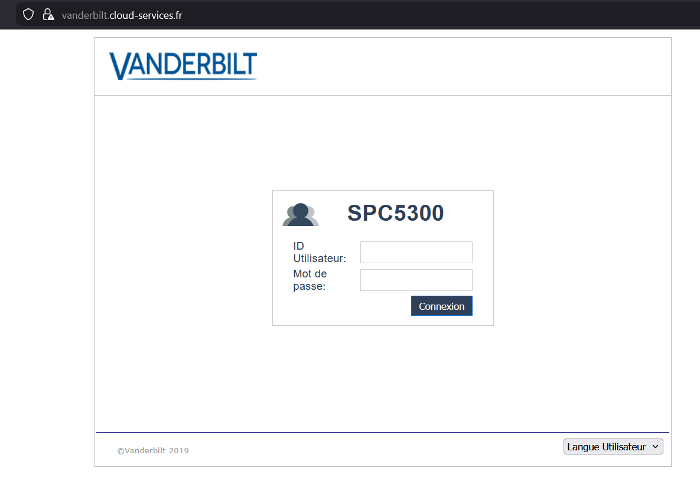
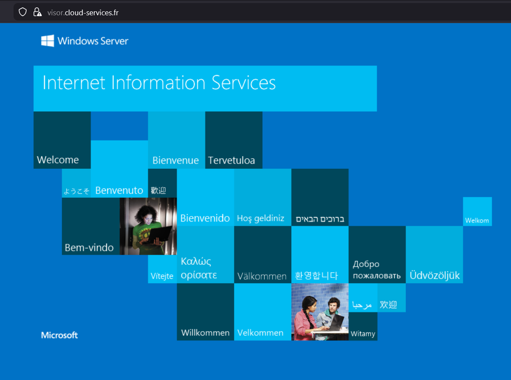
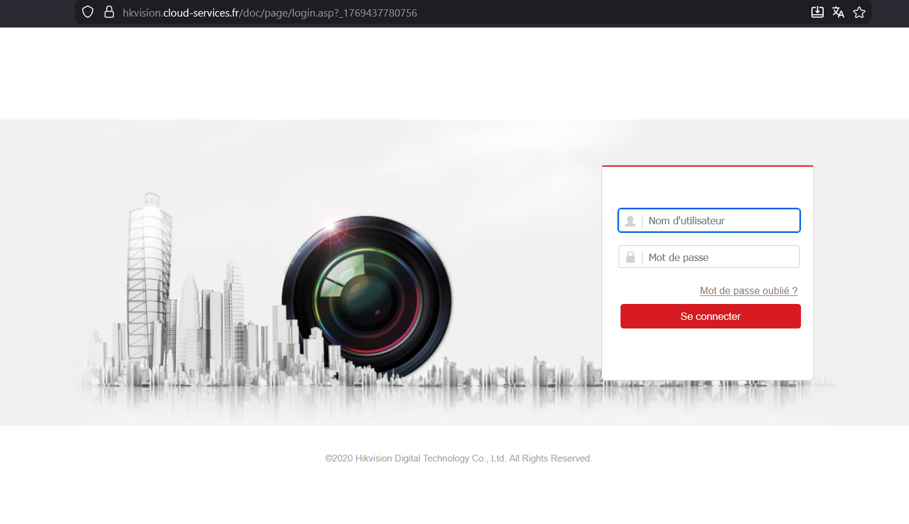
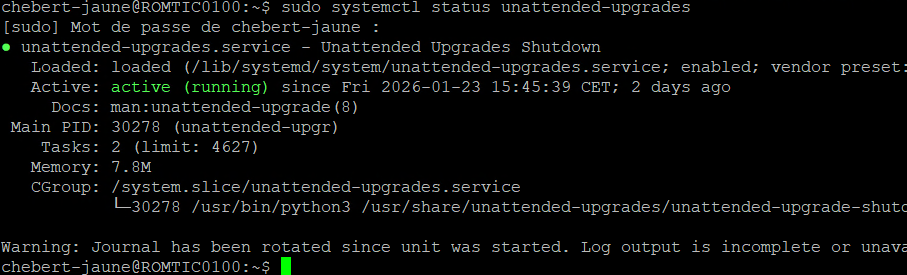
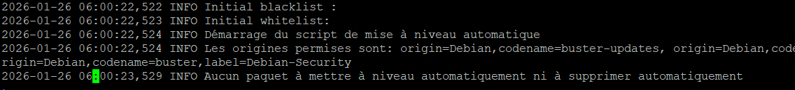
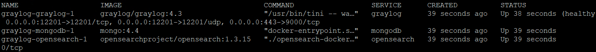
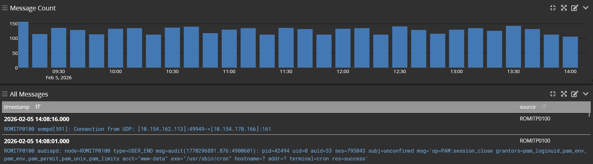

# Preuves de réalisation - Missions 1 & 2

Ce dossier contient les captures d'écran validant la configuration du reverse proxy, du SSL et du déploiement multi-sites.

## Mission 1 : Socle Technique & Sécurité

### 1. État du service Apache2

*Validation du bon fonctionnement du service Apache2 sur le serveur Linux.*

### 2. Validation de la redirection HTTP vers HTTPS

*L'inspecteur réseau affiche un code d'état **301** lors de l'accès en HTTP, confirmant la redirection automatique vers le port sécurisé.*

### 3. Détails du certificat SSL auto-signé

*Preuve de la création du certificat pour l'organisation **Linkt**. L'alerte navigateur est normale pour un certificat auto-signé.*

---
[⬅️ Retour à la documentation Apache2](../documentation/procedure-installation-apache.md)

## Mission 2 : Déploiement Multi-sites (VirtualHosts)

### 4. Test d'accès aux différents Backends
*Pour valider la configuration des 3 VirtualHosts, j'ai vérifié que chaque URL pointe bien vers le serveur correspondant.*

* **Accès Site 1** : 
* **Accès Site 2** : 
* **Accès Site 3** : 

> **Note technique** : On observe dans la barre d'adresse que l'URL change bien, mais que l'adresse IP publique (le Proxy) reste identique.

### 5. Page d'erreur personnalisée (403 Forbidden)

---
[⬅️ Retour à la documentation Multi-sites](../documentation/configuration-multi-url.md)

*Preuve de fonctionnement lorsqu'un utilisateur tente d'accéder au proxy via son adresse IP au lieu d'un nom de domaine autorisé.*

## Mission 3 : Maintenance Automatique

### 6. Validation du service Unattended-Upgrades

*Preuve que le service est actif et planifié sur le système.*

### 7. Historique des mises à jour (Logs)

*Extrait de `/var/log/unattended-upgrades/unattended-upgrades.log` confirmant le bon fonctionnement des derniers cycles.*

---
[⬅️ Retour à la documentation Unattended-Upgrades](../documentation/maintenance-automatique.md)

## Mission 4 : Gestion des Logs (Graylog)

### 8. État des conteneurs Docker

*Preuve du bon démarrage des conteneurs MongoDB, OpenSearch et Graylog.*

### 9. Interface Web Graylog et Réception des Logs

*Visualisation des logs arrivant en temps réel depuis le Reverse Proxy.*

---
[⬅️ Retour à la documentation Graylog](../documentation/centralisation-logs.md)

---
[⬅️ Retour au tableau de bord](../README.md)
