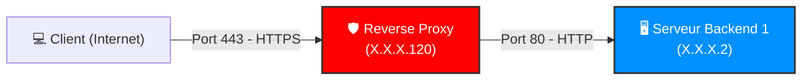
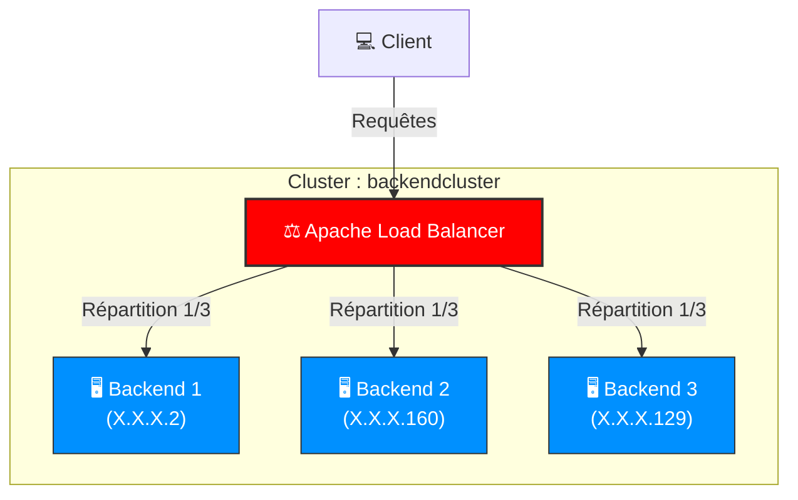
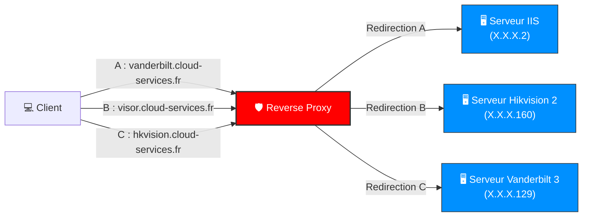

# Schémas Réseau et Évolution de l'Architecture
Ce dossier retrace l'évolution de l'infrastructure mise en place. Il permet de visualiser le passage d'un proxy simple à une solution multi-sites, en passant par l'étape de test du Load Balancing.

---
## 1. Architecture Initiale (Mission 1)
*Objectif : Sécuriser l'accès à un serveur unique via un tunnel HTTPS.*

## 2. Architecture de Test : Load Balancing (Mission 2 - V1)
*Objectif : Répartir la charge entre trois serveurs identiques (Haute Disponibilité).*

## 3. Architecture Finale : Multi-sites (Mission 2 - V2)
Objectif : Aiguiller les flux vers des services différents en fonction de l'URL demandée (VirtualHosts).

## Analyse du changement (V1 vers V2)
Le passage de la V1 (Load Balancing) à la V2 (Multi-sites) a été décidé suite à l'analyse des contenus : les serveurs backends hébergeant des services différents, la répartition de charge était incohérente. L'utilisation des VirtualHosts permet une gestion granulaire et précise de chaque application.

---
[⬅️ Retour au tableau de bord](../README.md)
