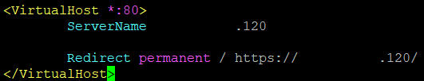
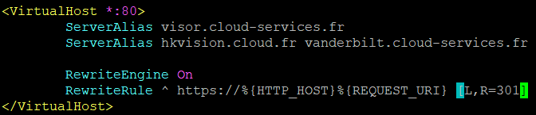
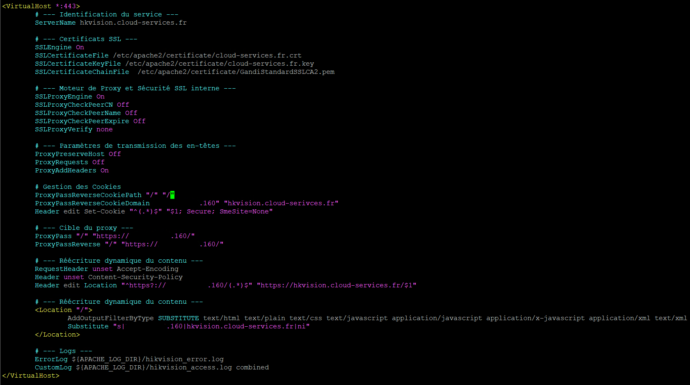
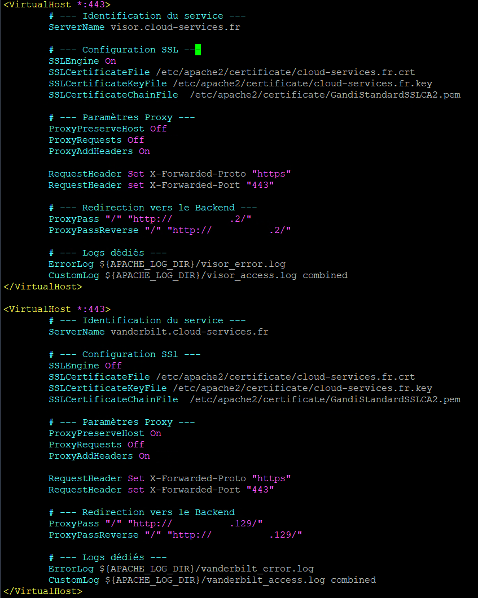
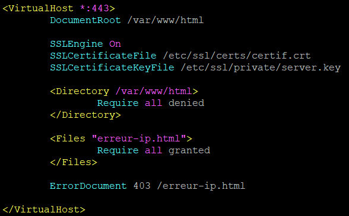
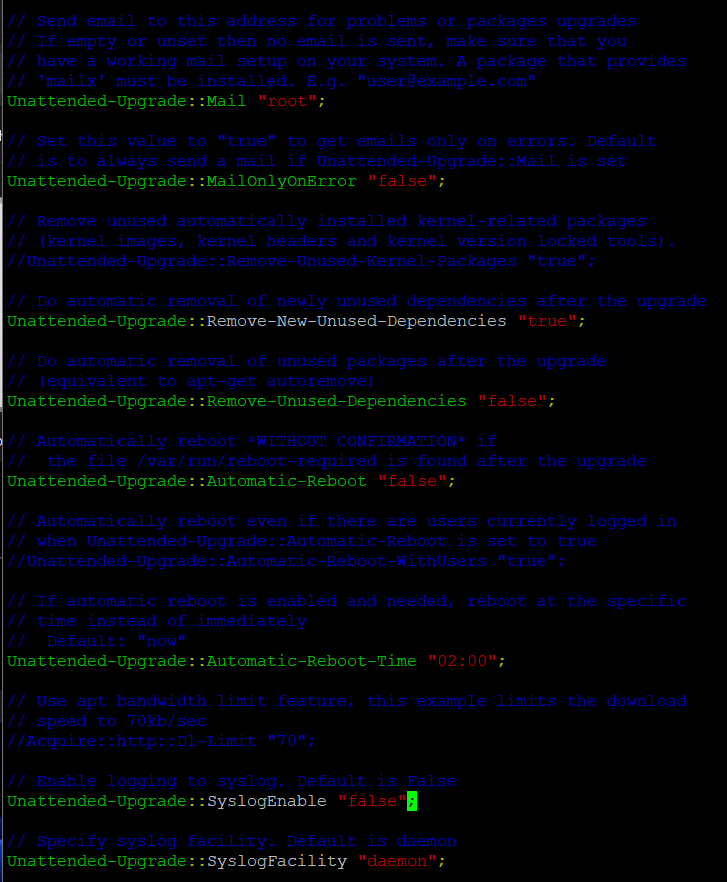
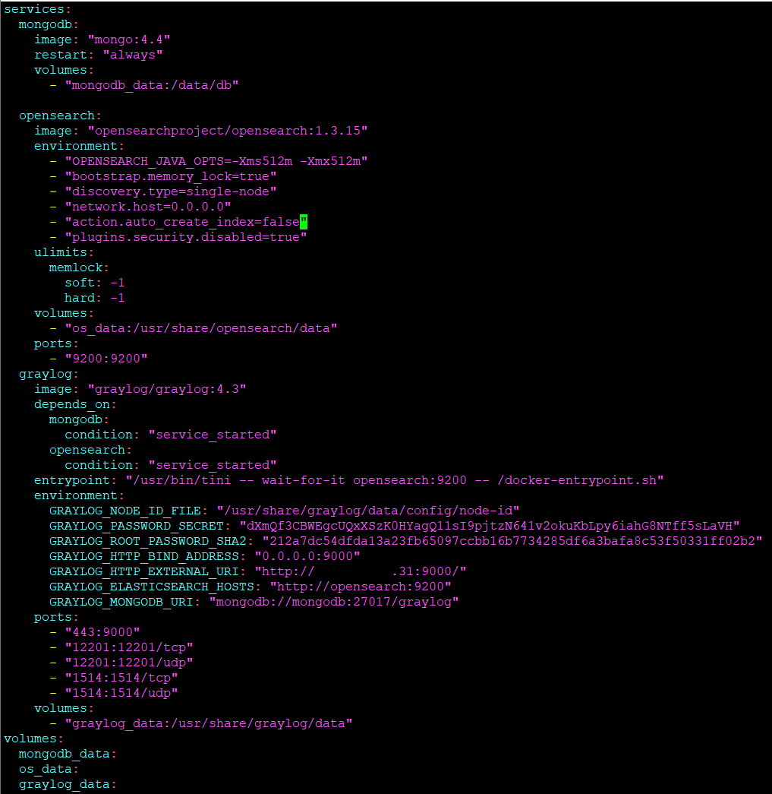

# Scripts et Configurations Apache

Ce dossier contient les fichiers de configuration mis en place pour le Reverse Proxy. La configuration est divisée en deux étapes : la gestion de la sécurité (redirection) et l'aiguillage multi-sites.

---

### 1️ Redirection forcée vers HTTPS
Ce bloc de configuration intercepte les requêtes arrivant sur le port **80 (HTTP)** pour les rediriger vers le port **443 (HTTPS)**. Cela garantit que tous les échanges avec les serveurs backends sont chiffrés.

*Ici, on utilise la directive `RewriteRule` vers l'URL en HTTPS.*

---
### 2️ Configuration Multi-sites (VirtualHosts HTTPS)
Ce script est le cœur de la **Mission 2**. Il permet de gérer les trois serveurs backends sur le port 443. Le proxy utilise le nom de domaine (URL) pour choisir le bon serveur.

> **Note :** Cette architecture remplace le Load Balancing pour permettre l'accès à trois services aux contenus différents.

*Les directives `ServerName` et `ProxyPass` permettent l'isolation et l'aiguillage des flux vers les IPs : .2, .160 et .129.*

### 3️ Gestion de l'accès par IP (Sécurisation)
Pour empêcher l'accès direct via l'adresse IP du proxy, un VirtualHost par défaut a été configuré pour rejeter les requêtes et afficher une page d'erreur personnalisée.

* **`Require all denied`** : Interdit l'accès au contenu racine.
* **`ErrorDocument 403`** : Redirige l'utilisateur vers une page HTML personnalisée en cas d'accès interdit.

### 4️ Automatisation des mises à jour (APT)
Configuration du service Unattended-Upgrades pour la maintenance du serveur.

*Extrait du fichier de configuration montrant les dépôts de sécurité autorisés.*

### 5️ Déploiement de la Stack Graylog
Utilisation de Docker Compose pour orchestrer les services de gestion de logs.

*Configuration des volumes, des réseaux et des variables d'environnement pour la stack Graylog.*

---
[⬅️ Retour au tableau de bord](../README.md)
