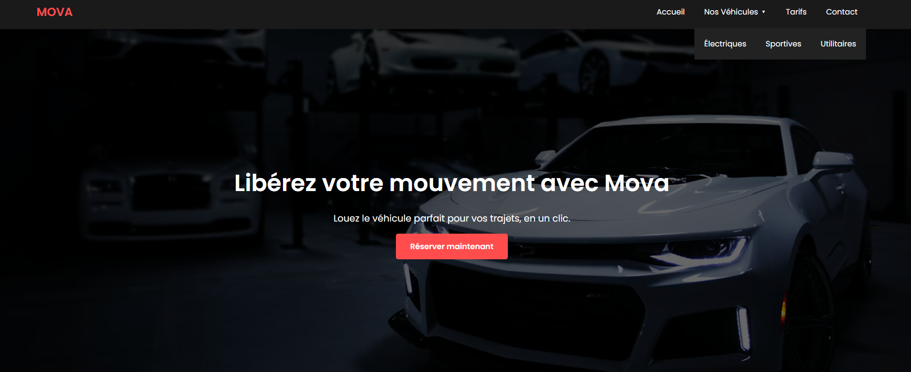

# Projet : Page d'accueil - Entreprise Mova

## Objectif
Concevoir et réaliser une interface web moderne pour une entreprise fictive afin de valider des compétences en développement.

## Réalisations techniques
* **Maquettage** : Création d'une interface responsive.
* **HTML / CSS** : Développement de la page avec mise en page moderne.
* **Charte graphique** : Respect des couleurs et de l'identité visuelle de l'entreprise.

## Rendu visuel de la page

---
[⬅️ Retour au tableau de bord](../../README.md)
